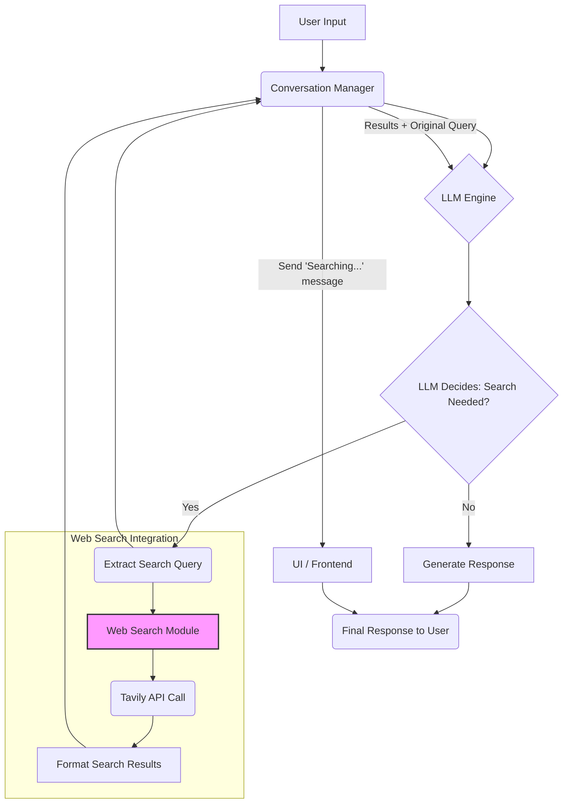
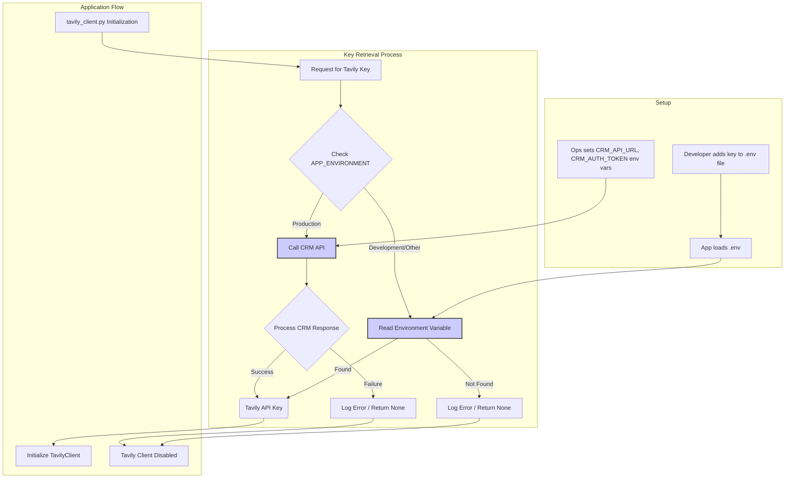

# Web Search Integration Plan (Tavily API) - v1.2

**Goal:** Enable the AI assistant to automatically perform web searches via the Tavily API when it determines external information is needed, providing user feedback during the process and using a secure, environment-aware method for API key management.

**Core Principles:**

1.  **LLM-Driven:** The decision to search the web originates from the LLM's reasoning process.
2.  **Targeted Search:** The LLM identifies the specific query for the web search.
3.  **Seamless Integration:** Search results are fed back to the LLM to synthesize the final answer.
4.  **User Feedback:** Inform the user when a web search is actively being performed.
5.  **Modularity:** Keep web search logic contained within the `web_search_module`.
6.  **Secure Configuration:** Manage the Tavily API key securely, fetching it from a CRM API in production and using `.env` for development.
7.  **Robustness:** Ensure existing functionality is not broken.

**Proposed Architecture (Web Search Flow):**

**Proposed Architecture (API Key Retrieval):**

**Detailed Steps:**

1.  **Setup & Dependencies:**
    *   Add `tavily-python` to the project's `requirements.txt`.
    *   Ensure `python-dotenv` is in `requirements.txt`.
    *   Ensure `.env` is listed in `.gitignore`.
    *   Create a `.env.example` file showing required variables (`TAVILY_API_KEY`, `CRM_API_URL`, `CRM_AUTH_TOKEN`).

2.  **API Key Management (`utils/key_manager.py`):**
    *   Create a new file `utils/key_manager.py`.
    *   Implement a function `get_api_key(key_name: str)`:
        *   Check `AppConfig.ENVIRONMENT`.
        *   **If 'production':**
            *   Read `CRM_API_URL` and `CRM_AUTH_TOKEN` from `AppConfig` (loaded from environment variables).
            *   Make an authenticated HTTPS request to the CRM API endpoint using `requests`.
            *   Parse the response to extract the requested `key_name` (e.g., 'TAVILY_API_KEY').
            *   Implement error handling (network, auth, parsing).
            *   (Optional) Implement caching for the fetched key.
            *   Return the key or `None` on failure.
        *   **If 'development' or other:**
            *   Ensure `load_dotenv()` is called early in the application startup (e.g., in `start_all.py` or `config.py`).
            *   Read the `key_name` directly from environment variables (which includes those loaded from `.env`).
            *   Return the key or `None` if not found.

3.  **Create Web Search Module (`RAI_Chat/Built_in_modules/web_search_module/`):**
    *   Create `__init__.py`.
    *   Create `tavily_client.py`:
        *   Import `TavilyClient` from `tavily`.
        *   Import `get_api_key` from `utils.key_manager`.
        *   Call `get_api_key('TAVILY_API_KEY')` to retrieve the key.
        *   Initialize the Tavily client *only if* the key is successfully retrieved.
        *   Implement `perform_search(query: str) -> str` function as previously defined, checking if the client was initialized.

4.  **Integrate with LLM Engine & Conversation Manager:**
    *   **Examine `RAI_Chat/conversation_manager.py` and `llm_Engine/`:** Determine the best method for LLM integration (Function Calling vs. Prompt Engineering - **Prompt Engineering selected based on current code**).
    *   **Update `RAI_Chat/prompts.py`:** Add instructions for the LLM to output `[SEARCH: query]` in `tier3` when a web search is needed.
    *   **Update `RAI_Chat/conversation_manager.py`:**
        *   Import `perform_search` from the `web_search_module`.
        *   In the `get_response` loop, add logic to detect `[SEARCH: query]` in the `tier3_response`.
        *   If detected:
            *   Extract the query.
            *   Log the action.
            *   **Add User Feedback:** Send a status message (e.g., "Searching the web...") to the UI/Frontend (mechanism TBD).
            *   Call `perform_search(query)`.
            *   Add the formatted results to `contextual_memory_str` (e.g., under a `WEB_SEARCH_RESULTS:` heading).
            *   Use `continue` to re-run the LLM prompt with the added search context.

5.  **UI Integration (Details TBD):**
    *   Define how the `Conversation Manager` communicates status updates (like "Searching...") to the frontend.

6.  **Testing:**
    *   Test development flow using a `.env` file.
    *   Test production flow (requires mocking the CRM API or using test credentials).
    *   Test scenarios requiring web search and verify UI feedback.
    *   Test scenarios not requiring web search.
    *   Test error handling (missing keys, API errors).

**Information Needed / Next Steps (Before Implementation):**

1.  **CRM API Details:**
    *   Exact CRM API endpoint URL for fetching keys.
    *   Authentication method required for the CRM API.
    *   Expected JSON response structure from the CRM API (how to extract the Tavily key).
2.  **Examine LLM Interaction:** Confirm Prompt Engineering (`[SEARCH: query]`) is the best fit after reviewing `conversation_manager.py` and `llm_Engine`. (**Confirmed**)
3.  **Examine UI Communication:** Understand backend-frontend communication for status messages.
4.  **Confirm `.env` Loading:** Decide where `load_dotenv()` should be called.