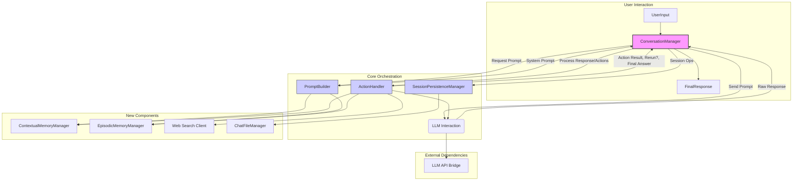

# Refactoring Plan: ConversationManager

**Date:** 2025-04-02

**Goal:** Refactor `RAI_Chat/conversation_manager.py` to improve modularity and maintainability by extracting key responsibilities into helper classes, while keeping `ConversationManager` as the central orchestrator. This aims to balance separation of concerns with manageable complexity and minimal latency impact.

## Current State Analysis

The existing `ConversationManager` handles numerous responsibilities:

1.  **Core Orchestration:** Managing the `get_response` flow.
2.  **Context Gathering:** Interacting with `ContextualMemoryManager` and `EpisodicMemoryManager`.
3.  **Prompt Construction:** Building the system prompt.
4.  **LLM Interaction:** Calling the LLM API.
5.  **Signal Processing:** Detecting LLM signals (e.g., `[FETCH:]`, `[SEARCH:]`).
6.  **Action Execution:** Performing actions based on signals (web search, memory fetch).
7.  **Session Management:** Loading, saving, listing, deleting chats via `ChatFileManager`.
8.  **State Management:** Tracking current session, timestamps.
9.  **Command Handling:** Processing special commands ("clear memory", "forget this").
10. **Utility Functions:** Post-processing responses, generating titles.

## Proposed Refactoring

We will keep `ConversationManager` central but extract the following responsibilities into dedicated helper classes:

1.  **`PromptBuilder`:**
    *   **Responsibility:** Consolidate all logic for gathering context (history, memory tiers, user profile, potential search results) and constructing the final system prompt string.
    *   **Interaction:** Called by `ConversationManager`. Interacts with `ContextualMemoryManager` and `EpisodicMemoryManager`.

2.  **`ActionHandler`:**
    *   **Responsibility:** Combine the logic for:
        *   Parsing the LLM's structured response.
        *   Detecting signals (`[FETCH:]`, `[SEARCH:]`, etc.).
        *   Executing the corresponding actions (calling web search, fetching/injecting memory chunks).
    *   **Interaction:** Called by `ConversationManager` after the LLM response is received. Interacts with memory managers and external services (like web search). Returns the final processed response or indicates if a re-run is needed.

3.  **`SessionPersistenceManager`:**
    *   **Responsibility:** Handle all interactions with `ChatFileManager` for loading, saving, listing, and deleting chat sessions from persistent storage.
    *   **Interaction:** Called by `ConversationManager` for session lifecycle operations. Interacts with `ChatFileManager`.

## High-Level Flow

1.  `ConversationManager.get_response` receives user input.
2.  It calls `PromptBuilder` to get the system prompt.
3.  It calls the LLM API (internal method or potentially a thin `LLMInterface`).
4.  It passes the LLM response to the `ActionHandler`.
5.  `ActionHandler` parses, acts, and returns the final answer or a re-run signal.
6.  `ConversationManager` uses `SessionPersistenceManager` for loading/saving chats as needed.

## Diagram

## Benefits

*   Improved modularity and separation of concerns.
*   Easier testing of individual components (`PromptBuilder`, `ActionHandler`, `SessionPersistenceManager`).
*   `ConversationManager` becomes a clearer orchestrator.
*   More manageable complexity compared to the initial multi-component proposal.
*   Minimal expected impact on latency.

## Next Steps

1.  Define precise interfaces (methods, parameters, return types) for the new classes.
2.  Implement the `PromptBuilder`, `ActionHandler`, and `SessionPersistenceManager` classes.
3.  Refactor `ConversationManager` to delegate responsibilities to the new classes.
4.  Update instantiation logic where `ConversationManager` is created.
5.  Implement comprehensive unit and integration tests.